# Awesome Know Your Business (KYB) Tools & Ecosystem 🏢



<p align="center">
  <a href="https://github.com/ishandutta2007/Awesome-Awesome-Awesome"></a>
  <a href="https://discord.gg/jc4xtF58Ve"></a>
  <a href="https://github.com/ishandutta2007/Awesome-Awesome-Awesome"></a>
  <a href="https://github.com/ishandutta2007/Awesome-Know-Your-Business"></a>
  <a href="https://github.com/ishandutta2007"></a>
</p>

A curated list of **Know Your Business (KYB)** SaaS platforms 💼, open-source compliance frameworks ⚡, beneficial ownership (UBO) graph tools 🕸️, corporate registry data APIs 📑, and risk decision engines 🛡️.

*Last updated: September 2026* 📅

---

## 📊 Executive Summary & Market Landscape

> **Market Size & Structure 📈:** The global **Know Your Business (KYB) and digital identity compliance market** is valued at **~$230 Million to $430 Million (software direct)**, with total system-wide KYB/KYC spending by financial institutions projected to surpass **$30 Billion by 2030**.
> 
> **Market Fragmentation 🧩:** The sector is **highly fragmented**, driven by siloed national corporate registries, varying international UBO disclosure laws, and regional compliance mandates. As a result, no single vendor holds a monopoly ("winner-take-all"), leading to widespread adoption of orchestration layers and open-source data standards like BODS (Beneficial Ownership Data Standard).

---

## 📑 Table of Contents

- [SaaS & Enterprise KYB Platforms 💼](#saas--enterprise-kyb-platforms-)
- [Open-Source GitHub Projects ⚡](#open-source-github-projects-)
- [Frameworks for Building Custom KYB Infrastructure 🏗️](#frameworks-for-building-custom-kyb-infrastructure-)
- [How to Contribute 🤝](#how-to-contribute-)
- [Support & Sponsorship 💖](#support--sponsorship-)
- [Star History 📈](#-star-history)
- [Disclaimer ⚠️](#disclaimer-)

---

## 💼 SaaS & Enterprise KYB Platforms

Below is a curated table of leading B2B SaaS platforms for business verification, UBO discovery, sanctions screening, and merchant onboarding. **Sorted by Market Scale / Valuation (Descending).**

| Company / Product | Market Scale / Valuation 💰 | Pricing (Starting Tier) 🏷️ | Free Tier / Trial Limit 🎁 | Key KYB Capabilities 🛠️ |
| :--- | :--- | :--- | :--- | :--- |
| **[Socure](https://www.socure.com/)** | **~$4.5 Billion** Valuation | $0.25 / check (Volume commit $1,500/mo min) | **$1,000 Free Credits** via Socure Launch program | AI/ML identity verification & predictive KYB for business bank account opening & merchant onboarding. |
| **[Persona](https://withpersona.com/)** | **~$2.0 Billion** Valuation | $250 / month (Starter plan) | **Free Sandbox Access** + 50 free test verifications | Configurable KYB & KYC workflows, automated UBO screening, and customizable developer-first APIs. |
| **[Trulioo](https://www.trulioo.com/)** | **~$1.75 Billion** Valuation | $0.80 / business check | **Free Developer Sandbox** with test credits | Global business verification across 195+ countries with real-time registry access and watchlist checks. |
| **[Veriff](https://www.veriff.com/)** | **~$1.5 Billion** Valuation | $49 / month ($0.80 / verification) | **15-Day Free Trial** (Includes 30 free verification checks) | AI-powered identity verification & KYB document validation for merchant & business onboarding. |
| **[Incode](https://incode.com/)** | **~$1.25 Billion** Valuation | $1,200 / year (Standard starter tier) | **30-Day Enterprise POC / Trial** available upon request | Fully automated AI verification platform with KYB modules for beneficial ownership discovery. |
| **[Middesk](https://www.middesk.com/)** | **~$760 Million** Valuation | $2.50 / KYB lookup ($49/mo minimum commitment) | **Free Demo / Test Sandbox** with 20 sample verification calls | Business identity verification API automating corporate entity checks, Secretary of State filings, and UBO discovery. |
| **[Creditsafe](https://www.creditsafe.com/)** | **~$692 Million** Valuation | $79 / month (Basic Business Credit Plan) | **7-Day Free Trial** (Includes 1 free comprehensive business credit report) | Global business credit & risk intelligence database covering company reports and director searches in 200+ countries. |
| **[Alloy](https://www.alloy.com/)** | **~$550 Million** Valuation | $10,000 / year (Enterprise Base) | **14-Day Sandbox Trial** for sandbox decision engine | Identity risk & compliance orchestration platform combining KYB, KYC, and transaction monitoring into single workflows. |
| **[Sumsub](https://sumsub.com/)** | **~$350 Million** Valuation | $1.35 / verification check ($149/mo base) | **14-Day Free Trial** (Includes 50 free check credits) | All-in-one KYB, KYC, and AML platform popular with fintechs and crypto exchanges for business verification. |
| **[ComplyAdvantage](https://complyadvantage.com/)** | **~$300 Million** Valuation | $500 / month (Essential AML Plan) | **12 Months Free Access** for startups via ComplyLaunch program | Global sanctions screening, adverse media monitoring, and real-time business risk intelligence API. |
| **[FullCircl](https://www.fullcircl.com/)** | **~$150 Million** Valuation | £1,500 / year (Starter License) | **30-Day Enterprise Pilot** program for prospective business users | Customer lifecycle intelligence platform combining KYB data, company financial health, and compliance onboarding. |
| **[Kyckr](https://www.kyckr.com/)** | **~$75 Million** Valuation | $15.00 / official registry extract check | **No Free Trial** (Direct-cost official government registry API access) | Direct real-time registry access providing official corporate filings across 170+ global jurisdictions. |
| **[Encompass](https://www.encompasscorporation.com/)** | **~$65 Million** Valuation | $25,000 / year (Enterprise Bank Tier) | **Custom Demo / Proof-of-Concept** trial for institutional banks | Automated corporate KYC/KYB visual mapping and multi-source registry data aggregation for corporate banking. |
| **[Signzy](https://www.signzy.com/)** | **~$50 Million** Valuation | ₹5,000 (~$60) monthly usage minimum | **Free Developer Sandbox** with ₹5,000 initial API test credits | AI digital onboarding platform specialized in India & emerging markets for GST, CIN, PAN, and director verification. |

---

## ⚡ Open-Source GitHub Projects

Below is a curated list of open-source tools for self-hosted KYB workflows, beneficial ownership (UBO) graph visualization, compliance watchlist screening, and registry data integration. **Sorted by GitHub Star Count (Descending).**

| Project Name 📦 | Stars ⭐ | Description & Key Features 📝 | Tech Stack / License ⚙️ |
| :--- | :--- | :--- | :--- |
| **[Ballerine](https://github.com/ballerine-io/ballerine)** | [](https://github.com/ballerine-io/ballerine/stargazers) | Open-source infrastructure and workflow orchestration for KYB, UBO discovery, case management, and risk decisioning. Y Combinator-backed. | TypeScript, React, Node.js (MIT) |
| **[OpenSanctions](https://github.com/opensanctions/opensanctions)** | [](https://github.com/opensanctions/opensanctions/stargazers) | International database of persons and business entities of interest, combining sanctions, PEPs, and corporate registry red flags. | Python, FollowTheMoney (MIT) |
| **[Moov Watchman](https://github.com/moov-io/watchman)** | [](https://github.com/moov-io/watchman/stargazers) | Open-source search engine for OFAC, EU, UN, and global sanctions list screening of companies and directors. | Go (Apache 2.0) |
| **[BODS Data Standard](https://github.com/openownership/data-standard)** | [](https://github.com/openownership/data-standard/stargazers) | Open specification and JSON schemas for modeling beneficial ownership (UBO) structures and control networks. | JSON Schema (CC-BY-4.0) |
| **[BODS Visualisation Tool](https://github.com/openownership/visualisation-tool)** | [](https://github.com/openownership/visualisation-tool/stargazers) | Library for rendering complex multi-layer corporate ownership structures in SVG/canvas using BODS data. | JavaScript, SVG (MIT) |
| **[Open Ownership Register](https://github.com/openownership/register)** | [](https://github.com/openownership/register/stargazers) | Open transnational database pipeline integrating corporate ownership records across UK, Denmark, Slovakia, and Armenia. | Python, PostgreSQL (MIT) |
| **[BODS Analysis Tools](https://github.com/openownership/bodsanalysis)** | [](https://github.com/openownership/bodsanalysis/stargazers) | Jupyter notebook tools for analyzing corporate ownership depth, circular ownership chains, and UBO opacity. | Python, Jupyter (MIT) |
| **[Handelsregister AI](https://github.com/Handelsregister-AI/handelsregister)** | [](https://github.com/Handelsregister-AI/handelsregister/stargazers) | Tool for scraping and extracting corporate data, UBO structures, and shareholder lists from official German company registers. | Python (MIT) |
| **[BODS Risk Detection](https://github.com/openownership/bodsriskdetection)** | [](https://github.com/openownership/bodsriskdetection/stargazers) | RDF and SPARQL queries for automated risk detection in beneficial ownership data (PEP exposure, offshore flags). | SPARQL, RDF (MIT) |
| **[Neo4j Companies House UBO](https://github.com/neo4j-graph-examples/companies-house-ubo)** | [](https://github.com/neo4j-graph-examples/companies-house-ubo/stargazers) | Neo4j graph implementation for modeling UK Companies House data to traverse multi-tiered ownership and identify UBOs. | Cypher, Neo4j, Python (Apache 2.0) |
| **[GLEIF BODS Pipeline](https://github.com/openownership/bods-gleif-pipeline)** | [](https://github.com/openownership/bods-gleif-pipeline/stargazers) | Transformation pipeline converting Global Legal Entity Identifier (LEI) data into BODS-compliant UBO graphs. | Python (MIT) |
| **[OpenCorporates Register Ingester](https://github.com/openownership/register-ingester-oc)** | [](https://github.com/openownership/register-ingester-oc/stargazers) | Data ingester pipeline mapping OpenCorporates company data into standardized BODS format. | Python (MIT) |
| **[KYC/KYB Entity Risk Scoring Engine](https://github.com/ishandutta2007/Awesome-Know-Your-Business)** | [](https://github.com/ishandutta2007/Awesome-Know-Your-Business/stargazers) | Gradient Boosting ML engine scoring business entity risk across 9 dimensions, with UBO Opacity carrying highest feature weight. | Python, scikit-learn, Pandas (MIT) |
| **[Open-KYC Package](https://github.com/College-Canine/open-kyc)** | [](https://github.com/College-Canine/open-kyc/stargazers) | NPM package searching business entity filings across US SEC EDGAR database and state corporate registers. | JavaScript, Node.js (ISC) |

---

## 🏗️ Frameworks for Building Custom KYB Infrastructure

For compliance engineering teams seeking self-hosted enterprise KYB platforms, consider this modular architectural stack:

```
┌─────────────────────────────────────────────────────────────────┐
│                    User Interface & Workflows                   │
│         Ballerine (Workflow Engine & Case Management UX)         │
└────────────────────────────────┬────────────────────────────────┘
                                 │
┌────────────────────────────────▼────────────────────────────────┐
│                   Data Orchestration & Risk ML                   │
│   KYB Entity Risk Scoring Engine + Moov Watchman (Sanctions)    │
└────────────────────────────────┬────────────────────────────────┘
                                 │
┌────────────────────────────────▼────────────────────────────────┐
│                    Graph Database & UBO Data                    │
│   Neo4j + BODS Data Standard (Open Ownership / OpenSanctions)   │
└─────────────────────────────────────────────────────────────────┘
```

1. **Workflow & Onboarding UI:** Deploy **[Ballerine](https://github.com/ballerine-io/ballerine)** for case management UI, document collection, and decision trees. 📱
2. **Watchlist & Sanctions Screening:** Integrate **[OpenSanctions](https://github.com/opensanctions/opensanctions)** or **[Moov Watchman](https://github.com/moov-io/watchman)** for real-time OFAC/PEP/sanctions matching. 🚨
3. **UBO Graph Modeling:** Store corporate ownership structures in **Neo4j** using the **[BODS Standard](https://github.com/openownership/data-standard)** for ownership graph traversal. 🕸️
4. **Risk Decisioning Engine:** Apply machine learning entity risk scoring to evaluate ownership opacity, jurisdiction risk, and adverse media exposure. 🤖

---

## 🤝 How to Contribute

Contributions are highly welcomed! Help us keep this directory complete and accurate:

1. Fork this repository. 🍴
2. Edit `README.md` following the table structure above. ✏️
3. Ensure SaaS additions include specific starting pricing tiers and exact free tier/trial limits. 💲
4. Ensure Open-Source additions include GitHub star badges linking to the repository stargazers page. ⭐
5. Open a Pull Request with a short summary of changes. 🚀

---

## 💖 Support & Sponsorship

Thank you for visiting and supporting the **Awesome Know Your Business (KYB)** ecosystem! 🌟

If you find this repository helpful for your compliance research, fintech engineering, or KYB architecture:
- Give us a **Star** ⭐ on GitHub to help others discover this project!
- **Fork** 🍴 and **Share** 📢 this repository with fellow developers, compliance officers, and fintech teams.
- Consider supporting ongoing maintenance by sponsoring through our [Sponsor Dashboard](https://github.com/sponsors/ishandutta2007) ☕.

---

## 📈 Star History
[](https://star-history.dera.page/#ishandutta2007/Awesome-Know-Your-Business&type=date&legend=top-left)

---

## ⚠️ Disclaimer

*This repository is a community-curated list for informational and educational purposes only. Mention of SaaS vendors or open-source software does not constitute an official endorsement. KYB procedures require strict adherence to local anti-money laundering (AML), counter-financing of terrorism (CFT), and corporate transparency regulations.*

---

*Maintained with ❤️ by the fintech compliance & engineering community. Star this repository if you find it helpful!*
